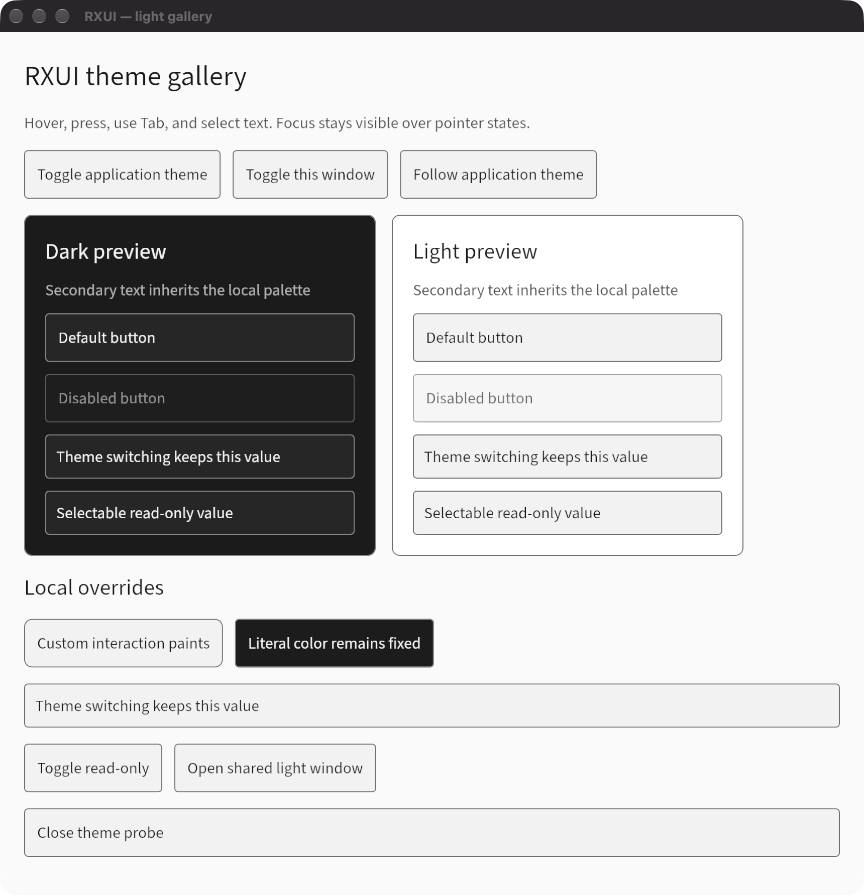

<h1 align="center">RXUI</h1>
<p align="center">A declarative desktop UI framework for Rust, rendered with Astrelis.</p>
<p align="center">
  <a href="https://github.com/hxyulin/rxui/actions/workflows/ci.yml"></a>
  <a href="Cargo.toml"></a>
  <a href="#license"></a>
</p>
<p align="center">
  <a href="docs/guide.md">Guide</a> ·
  <a href="crates/rxui/examples">Examples</a> ·
  <a href="docs/performance">Performance</a> ·
  <a href="CONTRIBUTING.md">Contributing</a>
</p>

You describe each view with builders, from persistent, typed application state.
RXUI reconciles the result against the previous frame by key, lays it out with
Taffy, routes input, publishes accessibility trees through AccessKit, and paints
with [Astrelis](https://github.com/hxyulin/astrelis) on wgpu.

```rust
use rxui::prelude::*;

struct Counter { value: i32 }

impl View for Counter {
    fn view(&self, cx: &mut ViewContext<'_, Self>) -> impl IntoElement {
        column().padding(24.).gap(12.)
            .child(label(format!("Count: {}", self.value)))
            .child(button("Increase").key("increase")
                .on_click(cx.listener(|this, _, _cx| this.value += 1)))
    }
}

fn main() -> Result<(), ApplicationError> {
    Application::new().run(|cx| {
        let counter = cx.new(|_| Counter { value: 0 });
        cx.open_window(WindowOptions::new().title("Counter"), counter)?;
        Ok(())
    })
}
```

<p align="center">
  <picture>
    <source media="(prefers-color-scheme: dark)" srcset="docs/images/theme-dark-validation.png">
    <source media="(prefers-color-scheme: light)" srcset="docs/images/theme-light-validation.png">
    
  </picture>
</p>

| Area | What RXUI provides |
| --- | --- |
| State | Shared `Entity<T>` state, weak listeners, dependency tracking and explicit flush boundaries |
| Composition | Element builders, keyed reconciliation, components and per-window placements |
| Layout | Flex rows and columns, stacks, absolute overlays, scroll areas, split panes and virtual lists |
| Controls | Buttons, controlled text input with IME and undo, tabs, menus, popovers, modals and docking |
| Input | Pointer and keyboard routing, capture, focus scopes, Tab traversal and typed commands with shortcuts |
| Styling | Light, dark and high-contrast themes, compact density, inherited text styles and state paints |
| Accessibility | Roles, names and actions, published through AccessKit only while assistive technology is active |
| Graphics | Images, live framebuffers, group opacity and hooks to record your own Astrelis passes |
| Desktop | Multiple windows, native menus, file dialogs, clipboard, file drop and saved window geometry |
| Async | Scoped background futures and blocking jobs that finish into live state |

## Status

RXUI is a rewrite. The workspace is at `0.2.0-dev` and nothing from it has been
released yet. Expect API changes between commits. The previous implementation
is tagged [`v0.1`](https://github.com/hxyulin/rxui/tree/v0.1) and kept on the
`legacy-v0.1` branch; there is no compatibility layer with its API.

The native host runs on macOS, Windows and Linux. Native menus are macOS and
Windows only.

## Getting started

RXUI requires Rust 1.98.1 or newer. Until the first release, depend on the
repository and enable the features you need:

```toml
[dependencies]
rxui = { git = "https://github.com/hxyulin/rxui", features = ["native"] }
```

| Feature | Adds |
| --- | --- |
| `layout` (default) | Elements, layout and input, headless with host-supplied text measurement |
| `rendering` | `UiPainter` over Astrelis, for embedding in your own render loop |
| `native` | The desktop `Application` host, AccessKit, clipboard and background tasks |
| `native-menus` | Menu bars and Close/Quit handling on macOS and Windows |
| `native-dialogs` | Parent-bound file and message dialogs |
| `desktop-services` | Opening URLs and files, and revealing files in the file manager |
| `image-decoding` | PNG and JPEG decoding |
| `accessibility`, `tasks` | AccessKit translation or background tasks without the native host |

With `--no-default-features`, only the state runtime remains.

Each example is one standalone file:

```sh
cargo run -p rxui --example gallery --features native           # every built-in component
cargo run -p rxui --example counter_window --features native    # the program above, plus a background task
cargo run -p rxui --example text_input_window --features native # controlled editing
cargo run -p rxui --example docking_window --features native    # tabs, splits and drag-to-dock
cargo run -p rxui --example counter_state                       # the state runtime in a terminal
```

The full set is in [`crates/rxui/examples`](crates/rxui/examples).

## Documentation

| Read | For |
| --- | --- |
| [Guide](docs/guide.md) | A tour of every feature area, with code |
| [Design](docs/next-design.md) | The architecture of the rewrite and why it is shaped this way |
| [Declarative core](docs/declarative-core.md) | Hosting sequence, identity, reuse and input |
| [Application](docs/application.md) and [async](docs/async.md) | Windows, close policy, custom hosts and tasks |
| [Layout](docs/layout.md), [interaction](docs/interaction.md) and [focus and tabs](docs/focus-and-tabs.md) | Arranging content and routing input |
| [Text input](docs/text-input.md) and [semantics](docs/semantics.md) | Editing, IME and accessibility |
| [Styling](docs/styling.md), [images](docs/images.md) and [compositing](docs/compositing.md) | Themes, pictures and group opacity |
| [Custom elements](docs/custom-elements.md) | Leaves that measure, hit-test and paint themselves |
| [Overlays and commands](docs/overlays-and-commands.md) and [docking](docs/docking.md) | Menus, dialogs, shortcuts and dock layouts |
| [Native menus](docs/native-menus.md), [services](docs/native-services.md) and [window state](docs/window-state-and-files.md) | Desktop integration |

`cargo doc -p rxui --all-features --open` builds the API reference.

## Acknowledgements

RXUI's application API is modeled on [GPUI](https://github.com/zed-industries/zed/tree/main/crates/gpui),
the framework behind the Zed editor. Designing for Rust's ownership rules led to
the same shape GPUI had already settled on: state owned by the application,
`Entity<T>` handles, context-based updates and `cx.listener` callbacks. RXUI
then used GPUI as its reference for naming and API. The two diverge below that
layer. RXUI tracks dependencies automatically instead of requiring explicit
notification, reconciles a retained element tree by key, and renders through
Astrelis and wgpu in a frame your own passes can join.

## Contributing

Bug reports, examples and pull requests are welcome. [CONTRIBUTING.md](CONTRIBUTING.md)
covers setup, working against a local Astrelis checkout, the checks to run and
what to include in a pull request.

## License

RXUI is available under either the [MIT license](LICENSE-MIT) or the
[Apache License 2.0](LICENSE-APACHE), at your option.

Unless you explicitly state otherwise, any contribution you intentionally submit
for inclusion in this project, as defined in the Apache-2.0 license, is dual
licensed as above, without any additional terms or conditions.

The Source Sans 3 test font uses the SIL Open Font License 1.1; see the
[font notes](crates/rxui/tests/fonts/README.md).
